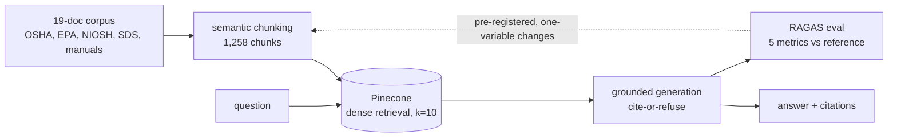

# evaluation-driven RAG over an industrial-equipment-safety corpus

A retrieval-augmented generation pipeline that answers questions about industrial-equipment-safety documents — OSHA/EPA/NIOSH regulations, chemical safety data sheets, and equipment manuals — built **evaluation-first**: the RAGAS harness was stood up before any retrieval or generation logic, and every change since was measured against it one variable at a time.

## What this demonstrates

The interesting part isn't "a RAG pipeline" — it's the method used to improve one. Each change was **pre-registered**: a written, falsifiable prediction committed to the repo *before* the eval ran (`eval/run_notes_*.md`). Changes were made **one variable at a time**, so every metric delta is attributable to a single cause. The **arbiter was the raw artifact** — the actual retrieved contexts and generated responses — not the aggregate score, which repeatedly misled (RAGAS `context_recall` returned `1.0` on rows where the answer chunk had not been retrieved at all). And two more-complex retrieval levers — a BM25-fusion fix for one stubborn cross-document row, then full hybrid (BM25 + dense) retrieval — were **falsified by read-only rank probes _before_ any eval run was spent on them**, because the probes showed a plain increase in retrieval depth strictly dominated both. The shipped pipeline is therefore *simpler* than the one originally planned: complexity was removed by evidence, not added on faith.

## Results

Five RAGAS metrics, scored against a hand-verified reference answer for each of the 28 eval questions. Each row is one measured change from a clean commit; full per-step deltas, the pre-registered prediction, and findings live in [`eval/METRICS_HISTORY.md`](eval/METRICS_HISTORY.md).

| Version | What changed | faithfulness | answer&#8209;relevancy | context&#8209;precision | context&#8209;recall | answer&#8209;correctness |
|---|---|--:|--:|--:|--:|--:|
| v0 | empty-pipeline baseline floor | `null` | 0.0000 | 0.0000 | 0.0000 | *not measured* |
| v1 | dense retrieval + grounded generation (`fixed_500_50` chunks, k=5) | 0.7143 | 0.6335 | 0.7761 | 0.7173 | 0.4042 |
| v2 | semantic chunking (1,258 chunks vs 7,635) | 0.7401 | 0.7092 | 0.8134 | 0.8889 | 0.5152 |
| v3 | generation prompt (synthesis + comparison + ground-every-claim) | 0.8309 | 0.7607 | 0.8258 | 0.9107 | 0.5128 |
| **v4** (shipped) | retrieval depth k=5 → **k=10** | **0.9697** | 0.8489 | 0.7589 | 0.9374 | **0.5667** |

Across four measured changes, **faithfulness rose 0.71 → 0.97** and **answer-correctness 0.40 → 0.57**. Faithfulness is the delta to trust — its run-to-run floor is ~0 (measured), so that climb is a credibility signal, not a lucky draw, whereas answer-correctness carries ~±0.03 judge noise (which is why the per-row reads, not the aggregate, settle close calls). The single metric that fell is context-precision at v4 (0.83 → 0.76) — the mechanical cost of grading twice as many chunks at k=10, not a quality loss: every per-row correctness dip was read and confirmed verbose-but-correct (faithfulness 1.0). The v4 aggregates are the mean of two fingerprint-tagged replicates.

## Architecture



Embeddings: OpenAI `text-embedding-3-small`. Generation: `gpt-4o-mini` (temperature 0, fixed seed). The generator answers **only** from retrieved context, cites the source document, and returns an exact refusal sentence when the answer is absent — so a bad retrieval yields an honest "not in context," never a fabrication.

## Corpus & provenance

**19 documents** in two licensing tiers — a deliberate IP decision recorded per-document in [`data/manifest.json`](data/manifest.json):

- **Tier 1 (10 docs) — public-domain government/agency sources**, committed under `data/public/`: OSHA regulations (1910.119 PSM, 1910.147 lockout/tagout, 1910.1000 air contaminants) and Technical Manual chapters, EPA Risk Management Program guidance, NIOSH publications (including the NIOSH Pocket Guide to Chemical Hazards), and a state-agency lockout/tagout guide.
- **Tier 2 (9 docs) — vendor-copyrighted sources**, whose raw PDFs stay **gitignored** under `data/raw/`: chemical SDS and equipment manuals from Airgas, Emerson (Fisher / Micro Motion), Flowserve, Nutrien, Sigma-Aldrich, Atlas Copco, and Fisher Scientific.

The copyrighted PDFs are never committed or redistributed — only their provenance (publisher, license, tier, page-level citation data) lives in the manifest, and final-answer citations render from the manifest **title**, never a raw filename.

## Setup

- Python 3.11, managed by [uv](https://docs.astral.sh/uv/).
- A `.env` at the repo root with: `OPENAI_API_KEY`, `PINECONE_API_KEY`, `LANGCHAIN_API_KEY`, `LANGCHAIN_TRACING_V2`, `LANGCHAIN_PROJECT` (and optionally `COHERE_API_KEY`, `INDEX_NAME`, `LLM_MODEL`).

```bash
uv sync
```

This creates the virtualenv, installs all pinned dependencies, **and editable-installs this project** so `from src.pipeline import ask` resolves from any script with no `sys.path` tricks.

> **Required after every fresh clone.** The editable install lives in `.venv/` (gitignored), so `src` is not importable until `uv sync` has run. Any `uv run …` command auto-syncs, so running a script also works, but an explicit `uv sync` first is the clean way to set up.

## Usage

Run everything from the repo root via `uv run`. The **shipped** configuration — the `semantic` namespace at depth **k=10** (the `v4` row above) — is now the default in [`src/config.py`](src/config.py) (`RETRIEVAL_NAMESPACE=semantic`, `RETRIEVAL_K=10`), so eval and the API need no retrieval overrides. Ingestion still selects semantic chunking explicitly, because `CHUNKING_STRATEGY` is an ingest-only knob that still defaults to `fixed_500_50`:

```bash
# Ingest the corpus into Pinecone — shipped (semantic) namespace (CHUNKING_STRATEGY defaults to fixed_500_50)
CHUNKING_STRATEGY=semantic uv run python src/ingest.py

# Evaluate the shipped pipeline (semantic namespace, k=10) with RAGAS over eval/dataset.jsonl — uses the config defaults
uv run python eval/run_eval.py

# Quick end-to-end sanity check of ask()
uv run python scripts/smoke_test.py
```

To reproduce an earlier baseline, override the retrieval env vars — e.g. the v1 baseline is `RETRIEVAL_NAMESPACE=fixed_500_50 RETRIEVAL_K=5 uv run python eval/run_eval.py`, ingested to `fixed_500_50` via the default `CHUNKING_STRATEGY` (`uv run python src/ingest.py`).

## Reproducibility

Each version regenerates by **checking out its commit and running the eval with the namespace/depth it used** — not by one command at `HEAD`, since the generation prompt and config differ per version. (`RETRIEVAL_K` is a v4-era knob; v1–v3 ran at the then-default k=5. Namespace is chosen by `CHUNKING_STRATEGY` at ingest and `RETRIEVAL_NAMESPACE` at eval.)

| Version | Commit | Namespace | k | Result file (gitignored) |
|---|---|---|--:|---|
| v0 | `9fd0dc7` | — | — | `baseline_v0_*` |
| v1 | `a76f09a` | `fixed_500_50` | 5 | `v1_fixed_500_50_*` |
| v2 | `87ae545` | `semantic` | 5 | `v2_semantic_*` |
| v3 | `6b416ed` | `semantic` | 5 | `v3_prompt_*` |
| **v4** (shipped) | `5e742d2` | `semantic` | 10 | `v4_densek10_*` |

Worked example — regenerate the shipped v4 numbers:

```bash
RETRIEVAL_NAMESPACE=semantic RETRIEVAL_K=10 uv run python eval/run_eval.py
```

Three honest caveats:

- **Aggregates reproduce within a documented noise floor (~±0.03 answer-correctness; faithfulness ~0), not byte-identically.** Generation is not run-to-run deterministic — an identical-config rerun differed on 14 of 28 rows, and OpenAI's backend `system_fingerprint` drifts between runs (a matching fingerprint doesn't even guarantee identical output across time-separated runs). This is characterized and expected, which is exactly why per-row reads — not the aggregate — are treated as the verdict.
- **Full reproduction needs your own resources:** a Pinecone index, an OpenAI key, and the corpus ingested. Because the Tier-2 vendor PDFs are gitignored, a fresh clone cannot fully re-ingest the corpus without obtaining those sources.
- **[`eval/METRICS_HISTORY.md`](eval/METRICS_HISTORY.md)** holds the full per-version detail — deltas, the pre-registered prediction for each change, and the findings (including the two falsified levers) — rather than duplicating it here.

## Known limitations / deferred

- **Two rows are still retrieval misses at k=10:** the NIOSH-IDLH-vs-EPA-endpoint comparison and the acetone flash-point lookup. In each, the needed value sits in a cross-source or dense tabular chunk that is lexically and semantically dissimilar to the natural-language question, so neither greater depth nor lexical (BM25) fusion surfaces it — the latter was probed and falsified. The real fix is **query decomposition** (per-source sub-lookups) or table-aware extraction, scoped to Phase 2 (agentic).
- **Page-level citation accuracy is imperfect:** one recovered answer cited the correct *document* but the wrong *page*. The `{document, page}` citation contract is an open generation-side concern for the forthcoming API service (Step 5).

## Links

- [`eval/METRICS_HISTORY.md`](eval/METRICS_HISTORY.md) — per-version metrics, deltas, pre-registered predictions, findings.
- [`scripts/README.md`](scripts/README.md) — developer tooling (smoke test, eval enrichment/audit, grounding checks).
- [`CLAUDE.md`](CLAUDE.md) — project conventions (eval-first, the five canonical metrics, provenance/citation rules).
