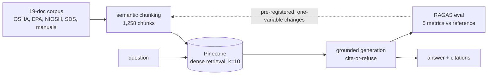
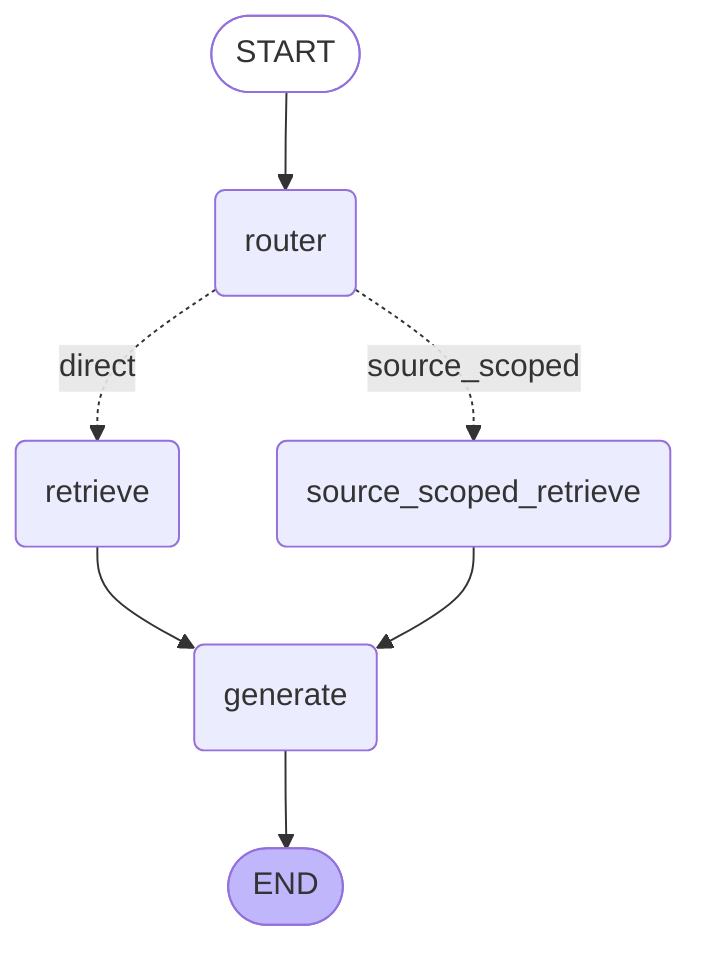

# evaluation-driven RAG over an industrial-equipment-safety corpus

[](https://github.com/FernandoSanabria/rag-pipeline/actions/workflows/ci.yml)

A retrieval-augmented generation pipeline that answers questions about industrial-equipment-safety documents — OSHA/EPA/NIOSH regulations, chemical safety data sheets, and equipment manuals — built **evaluation-first**: the RAGAS harness was stood up before any retrieval or generation logic, and every change since was measured against it one variable at a time.

## What this demonstrates

The interesting part isn't "a RAG pipeline" — it's the method used to improve one. Each change was **pre-registered**: a written, falsifiable prediction committed to the repo *before* the eval ran (`eval/run_notes_*.md`). Changes were made **one variable at a time**, so every metric delta is attributable to a single cause. The **arbiter was the raw artifact** — the actual retrieved contexts and generated responses — not the aggregate score, which repeatedly misled (RAGAS `context_recall` returned `1.0` on rows where the answer chunk had not been retrieved at all). And two more-complex retrieval levers — a BM25-fusion fix for one stubborn cross-document row, then full hybrid (BM25 + dense) retrieval — were **falsified by read-only rank probes _before_ any eval run was spent on them**, because the probes showed a plain increase in retrieval depth strictly dominated both. The shipped pipeline is therefore *simpler* than the one originally planned: complexity was removed by evidence, not added on faith.

## Live demo

A deployed instance is live at **https://equip-docs-rag-api.onrender.com** (`POST /ask`, `GET /health`):

```bash
curl -s -X POST https://equip-docs-rag-api.onrender.com/ask \
  -H 'Content-Type: application/json' \
  -d '{"question":"In an ammonia refrigeration system, why is a vapor-space rupture unlikely to be the worst-case release compared to a liquid release?"}'
```

Every answer is a typed contract — `answer`, `citations: [{document, page}]`, `confidence_score`, `confidence_basis` — so a caller gets the grounded answer, its sources, and a plain-language reason for the confidence.

**Honest refusal, never fabrication.** Ask something outside the corpus (`{"question": "What is the capital of France?"}`) and the service returns the exact refusal sentence with `confidence_score` 0.25 and empty `citations` — it declines rather than inventing an answer.

**Citations come from retrieval metadata, not the model's prose.** In one live response the model's prose cited *page 17* while the structured `citations` field returned *page 23* — the retrieved chunk's true page. Because `{document, page}` is derived from chunk metadata (never parsed from the answer text), the page a reader is sent to is correct by construction even when the model mis-cites itself. (The in-prose page isn't stable across runs; the metadata page is deterministic.)

_Free tier:_ the first request after idle cold-starts in ~30–60s; warm requests are fast. `GET /health` → `{"status":"ok"}`.

### `POST /ask/agent` — the agentic path (routing transparency)

`/ask/agent` serves the LangGraph agent instead of the frozen v4 pipeline. It returns the same typed contract **plus** `route` (`"direct"` | `"source_scoped"`), and — when a question is anchored to one named document (e.g. *"the flash point of acetone per the Sigma-Aldrich SDS"*) — `source_doc_id` and a human-readable `routing_reason`. Source-scoping recovers single-document lookups that the full-corpus path buries (the acetone flash point moves from rank ~19 to top-3, correctness 0.036 → 0.717).

**Cost — read this before switching.** `/ask/agent` pays a `gpt-4o-mini` router call (~1s, ~$0.0001) on **every** request, including the ~85% of questions that then route direct and get the identical `/ask` answer. So it is the **richer** path (source-scoped routing + the transparency payload) at a **fixed per-request cost**, not a strict upgrade — `/ask` pays nothing and serves the same answer on a non-source-anchored question. Use `/ask/agent` when you want single-document scoping and to see the route taken; use `/ask` when you don't. A router hiccup or a filtered-retrieval failure/empty both fall back to the direct full-corpus path inside the graph, so the endpoint degrades to a full-corpus answer rather than erroring.

## Performance

Indicative `/ask` latency, measured **warm** against the live free-tier service (n=18 varied questions, single session — a rough read, not a rigorous benchmark):

| warm `/ask` — client-side, end-to-end | P50 | P95 | min / mean / max |
|---|--:|--:|--:|
| network + free-tier host + full pipeline | **3.7s** | **11.0s** | 1.7 / 4.7 / 13.2s |

**Cold-start is excluded — and isn't the headline.** A free-tier service spins down after ~15 min idle, so the first hit after a gap is slow (measured: `/health` ~43s to wake, first `/ask` after wake ~17s). A scheduled [keep-warm ping](.github/workflows/keepalive.yml) mitigates spin-down but keeps only the *process* warm, so a first `/ask` after a long gap can still pay some pipeline-init cost.

**Generation dominates — take the _ratio_, not the seconds.** A separate local probe (n=4, k=10, run from a different machine with its own network path to OpenAI) splits the pipeline into retrieval ~1.6s vs generation ~4.2s: generation is **~3×** retrieval (up to ~88% on long procedural answers), so the bulk of `/ask` is the `gpt-4o-mini` call, not retrieval. Those absolute seconds intentionally **do not reconcile** with the deployed table above — their sum (~5.8s) even exceeds the 3.7s deployed P50 — because this is a smaller, different-infrastructure sample skewed toward the slow procedural questions, whereas the deployed P50 is a median over 18 that includes fast one-liners. Take only the ratio from it. On the deployed service, latency tracks answer length: fastest was the one-line refusal (1.7s), slowest the lockout/tagout sequence (13.2s).

## Results

Five RAGAS metrics, scored against a hand-verified reference answer for each of the 28 eval questions. Each row is one measured change from a clean commit; full per-step deltas, the pre-registered prediction, and findings live in [`eval/METRICS_HISTORY.md`](eval/METRICS_HISTORY.md).

| Version | What changed | faithfulness | answer&#8209;relevancy | context&#8209;precision | context&#8209;recall | answer&#8209;correctness |
|---|---|--:|--:|--:|--:|--:|
| v0 | empty-pipeline baseline floor | `null` | 0.0000 | 0.0000 | 0.0000 | *not measured* |
| v1 | dense retrieval + grounded generation (`fixed_500_50` chunks, k=5) | 0.7143 | 0.6335 | 0.7761 | 0.7173 | 0.4042 |
| v2 | semantic chunking (1,258 chunks vs 7,635) | 0.7401 | 0.7092 | 0.8134 | 0.8889 | 0.5152 |
| v3 | generation prompt (synthesis + comparison + ground-every-claim) | 0.8309 | 0.7607 | 0.8258 | 0.9107 | 0.5128 |
| **v4** (shipped) | retrieval depth k=5 → **k=10** | **0.9697** | 0.8489 | 0.7589 | 0.9374 | **0.5667** |

Across four measured changes, **faithfulness rose 0.71 → 0.97** and **answer-correctness 0.40 → 0.57**. Faithfulness is the delta to trust — its run-to-run floor is ~0 (measured), so that climb is a credibility signal, not a lucky draw, whereas answer-correctness carries ~±0.03 judge noise (which is why the per-row reads, not the aggregate, settle close calls). The single metric that fell is context-precision at v4 (0.83 → 0.76) — the mechanical cost of grading twice as many chunks at k=10, not a quality loss: every per-row correctness dip was read and confirmed verbose-but-correct (faithfulness 1.0). The v4 aggregates are the mean of two fingerprint-tagged replicates.

## Architecture


```mermaid
flowchart LR
    C["19-doc corpus<br/>OSHA, EPA, NIOSH, SDS, manuals"] --> CH["semantic chunking<br/>1,258 chunks"]
    CH --> P[("Pinecone<br/>dense retrieval, k=10")]
    Q["question"] --> P
    P --> G["grounded generation<br/>cite-or-refuse"]
    G --> A["answer + citations"]
    G --> E["RAGAS eval<br/>5 metrics vs reference"]
    E -.->|"pre-registered, one-variable changes"| CH
```

Embeddings: OpenAI `text-embedding-3-small`. Generation: `gpt-4o-mini` (temperature 0, fixed seed). The generator answers **only** from retrieved context, cites the source document, and returns an exact refusal sentence when the answer is absent — so a bad retrieval yields an honest "not in context," never a fabrication.

### Request-serving graph — `/ask` vs `/ask/agent`

The shipped pipeline is v4 dense retrieval over the **`semantic_v2`** namespace (structure-aware re-chunking — the 2B lever that recovered the NIOSH-IDLH-vs-EPA-endpoint comparison). On top of it, the LangGraph agent adds a **router** that source-scopes single-document questions. Two endpoints serve it:

- **`POST /ask`** — the direct v4 path (`retrieve → generate`) on `semantic_v2`. The shipped, promoted default: no router, no per-request LLM tax.
- **`POST /ask/agent`** — `router → {direct | source_scoped} → generate`. Pays a `gpt-4o-mini` router call (~1s, ~$0.0001) on **every** request to recover source-anchored questions (e.g. the acetone flash point "per the Sigma-Aldrich SDS"), and returns the route taken (`route` / `source_doc_id` / `routing_reason`). The richer path — **not** a drop-in replacement for `/ask`.

<!-- regenerate: uv run python scripts/render_graph.py -->

```mermaid
graph TD;
    __start__([START]):::first
    router(router)
    retrieve(retrieve)
    source_scoped_retrieve(source_scoped_retrieve)
    generate(generate)
    __end__([END]):::last
    __start__ --> router;
    router -. direct .-> retrieve;
    router -. source_scoped .-> source_scoped_retrieve;
    retrieve --> generate;
    source_scoped_retrieve --> generate;
    generate --> __end__;
    classDef first fill-opacity:0
    classDef last fill:#bfb6fc
```

**Two safety properties are visible in the graph:** `source_scoped_retrieve` falls back to the direct full-corpus path on a filter failure or empty result, and `generate` short-circuits on `retrieval_error` — so a router hiccup or a bad metadata filter degrades to a valid answer, never a 500.

**Observability:** the path taken is inspectable, not just diagrammed — LangSmith traces (`@traceable` spans, one per node) and `state["trace_notes"]` (one breadcrumb per node) both record the route each request actually followed.

## Corpus & provenance

**19 documents** in two licensing tiers — a deliberate IP decision recorded per-document in [`data/manifest.json`](data/manifest.json):

- **Tier 1 (10 docs) — public-domain government/agency sources**, committed under `data/public/`: OSHA regulations (1910.119 PSM, 1910.147 lockout/tagout, 1910.1000 air contaminants) and Technical Manual chapters, EPA Risk Management Program guidance, NIOSH publications (including the NIOSH Pocket Guide to Chemical Hazards), and a state-agency lockout/tagout guide.
- **Tier 2 (9 docs) — vendor-copyrighted sources**, whose raw PDFs stay **gitignored** under `data/raw/`: chemical SDS and equipment manuals from Airgas, Emerson (Fisher / Micro Motion), Flowserve, Nutrien, Sigma-Aldrich, Atlas Copco, and Fisher Scientific.

The copyrighted PDFs are never committed or redistributed — only their provenance (publisher, license, tier, page-level citation data) lives in the manifest, and final-answer citations render from the manifest **title**, never a raw filename.

## Setup

- Python 3.11, managed by [uv](https://docs.astral.sh/uv/).
- A `.env` at the repo root with: `OPENAI_API_KEY`, `PINECONE_API_KEY`, `LANGCHAIN_API_KEY`, `LANGCHAIN_TRACING_V2`, `LANGCHAIN_PROJECT` (and optionally `COHERE_API_KEY`, `INDEX_NAME`, `LLM_MODEL`).

```bash
uv sync
```

This creates the virtualenv, installs all pinned dependencies, **and editable-installs this project** so `from src.pipeline import ask` resolves from any script with no `sys.path` tricks.

> **Required after every fresh clone.** The editable install lives in `.venv/` (gitignored), so `src` is not importable until `uv sync` has run. Any `uv run …` command auto-syncs, so running a script also works, but an explicit `uv sync` first is the clean way to set up.

## Usage

Run everything from the repo root via `uv run`. The **shipped** configuration — the `semantic_v2` namespace (structure-aware re-chunk of the NIOSH Pocket Guide + acetone SDS; the 2B IDLH recovery, promoted after a fingerprint-matched like-for-like with no regression beyond −0.03) at depth **k=10** — is the default in [`src/config.py`](src/config.py) (`RETRIEVAL_NAMESPACE=semantic_v2`, `RETRIEVAL_K=10`); local/eval use that default, and **production pins it explicitly** in [`render.yaml`](render.yaml) so declared == live. Roll back to the v4 namespace with a one-line `render.yaml` PR (`RETRIEVAL_NAMESPACE=semantic`). Ingestion is **guarded**: `CHUNKING_STRATEGY` picks the namespace ingest *writes* (default `fixed_500_50`) while retrieval *reads* `RETRIEVAL_NAMESPACE` (default `semantic_v2`), so `src/ingest.py` refuses to run unless you set `RETRIEVAL_NAMESPACE` explicitly to match the write target — a bare defaults-only run fails loudly rather than populating a namespace nothing reads. The shipped `semantic_v2` is a **two-step build** (ingest `semantic`, then copy + re-chunk), not a direct ingest target:

```bash
# Build the shipped semantic_v2 namespace — (1) ingest the `semantic` namespace (explicit match required by the guard), then (2) copy + re-chunk
RETRIEVAL_NAMESPACE=semantic CHUNKING_STRATEGY=semantic uv run python src/ingest.py
uv run python scripts/build_semantic_v2.py   # copies 17 docs byte-identical + re-chunks the 2 targets -> semantic_v2 (1,756 vectors)

# Evaluate the shipped pipeline (semantic_v2 namespace, k=10) with RAGAS over eval/dataset.jsonl — uses the config defaults
uv run python eval/run_eval.py

# Quick end-to-end sanity check of ask()
uv run python scripts/smoke_test.py
```

To reproduce an earlier baseline, override the retrieval env vars — e.g. the v1 baseline is `RETRIEVAL_NAMESPACE=fixed_500_50 RETRIEVAL_K=5 uv run python eval/run_eval.py`, ingested to `fixed_500_50` with an explicit matching namespace: `RETRIEVAL_NAMESPACE=fixed_500_50 uv run python src/ingest.py` (default `CHUNKING_STRATEGY` already targets `fixed_500_50`; the guard just requires you to say so).

## Reproducibility

Each version regenerates by **checking out its commit and running the eval with the namespace/depth it used** — not by one command at `HEAD`, since the generation prompt and config differ per version. (`RETRIEVAL_K` is a v4-era knob; v1–v3 ran at the then-default k=5. Namespace is chosen by `CHUNKING_STRATEGY` at ingest and `RETRIEVAL_NAMESPACE` at eval.)

| Version | Commit | Namespace | k | Result file (gitignored) |
|---|---|---|--:|---|
| v0 | `9fd0dc7` | — | — | `baseline_v0_*` |
| v1 | `a76f09a` | `fixed_500_50` | 5 | `v1_fixed_500_50_*` |
| v2 | `87ae545` | `semantic` | 5 | `v2_semantic_*` |
| v3 | `6b416ed` | `semantic` | 5 | `v3_prompt_*` |
| **v4** (shipped) | `5e742d2` | `semantic` | 10 | `v4_densek10_*` |

Worked example — regenerate the shipped v4 numbers:

```bash
RETRIEVAL_NAMESPACE=semantic RETRIEVAL_K=10 uv run python eval/run_eval.py
```

Three honest caveats:

- **Aggregates reproduce within a documented noise floor (~±0.03 answer-correctness; faithfulness ~0), not byte-identically.** Generation is not run-to-run deterministic — an identical-config rerun differed on 14 of 28 rows, and OpenAI's backend `system_fingerprint` drifts between runs (a matching fingerprint doesn't even guarantee identical output across time-separated runs). This is characterized and expected, which is exactly why per-row reads — not the aggregate — are treated as the verdict.
- **Full reproduction needs your own resources:** a Pinecone index, an OpenAI key, and the corpus ingested. Because the Tier-2 vendor PDFs are gitignored, a fresh clone cannot fully re-ingest the corpus without obtaining those sources.
- **[`eval/METRICS_HISTORY.md`](eval/METRICS_HISTORY.md)** holds the full per-version detail — deltas, the pre-registered prediction for each change, and the findings (including the two falsified levers) — rather than duplicating it here.

## Known limitations / deferred

- **Two rows are still retrieval misses at k=10:** the NIOSH-IDLH-vs-EPA-endpoint comparison and the acetone flash-point lookup. In each, the needed value sits in a cross-source or dense tabular chunk that is lexically and semantically dissimilar to the natural-language question, so neither greater depth nor lexical (BM25) fusion surfaces it — the latter was probed and falsified. The real fix is **query decomposition** (per-source sub-lookups) or table-aware extraction, scoped to Phase 2 (agentic).
- **Page-level citation accuracy is imperfect:** one recovered answer cited the correct *document* but the wrong *page*. The `{document, page}` citation contract is an open generation-side concern for the forthcoming API service (Step 5).

## Links

- [`eval/METRICS_HISTORY.md`](eval/METRICS_HISTORY.md) — per-version metrics, deltas, pre-registered predictions, findings.
- [`scripts/README.md`](scripts/README.md) — developer tooling (smoke test, eval enrichment/audit, grounding checks).
- [`CLAUDE.md`](CLAUDE.md) — project conventions (eval-first, the five canonical metrics, provenance/citation rules).
