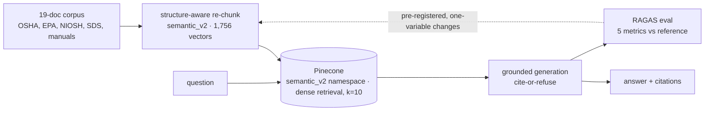
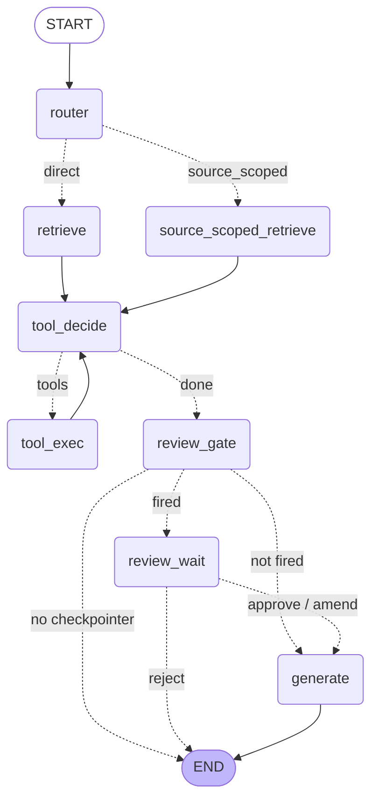

# evaluation-driven RAG over an industrial-equipment-safety corpus

[](https://github.com/FernandoSanabria/rag-pipeline/actions/workflows/ci.yml) [](https://github.com/FernandoSanabria/rag-pipeline/actions/workflows/eval-smoke.yml)

A retrieval-augmented generation pipeline that answers questions about industrial-equipment-safety documents — OSHA/EPA/NIOSH regulations, chemical safety data sheets, and equipment manuals — built **evaluation-first**: the RAGAS harness was stood up before any retrieval or generation logic, and every change since was measured against it one variable at a time.

## What this demonstrates

The interesting part isn't "a RAG pipeline" — it's the method used to improve one. Each change was **pre-registered**: a written, falsifiable prediction committed to the repo *before* the eval ran (`eval/run_notes_*.md`). Changes were made **one variable at a time**, so every metric delta is attributable to a single cause. The **arbiter was the raw artifact** — the actual retrieved contexts and generated responses — not the aggregate score, which repeatedly misled (RAGAS `context_recall` returned `1.0` on rows where the answer chunk had not been retrieved at all). And two more-complex retrieval levers — a BM25-fusion fix for one stubborn cross-document row, then full hybrid (BM25 + dense) retrieval — were **falsified by read-only rank probes _before_ any eval run was spent on them**, because the probes showed a plain increase in retrieval depth strictly dominated both. The shipped pipeline is therefore *simpler* than the one originally planned: complexity was removed by evidence, not added on faith.

## Live demo

A deployed instance is live at **https://equip-docs-rag-api.onrender.com** (`POST /ask`, `GET /health`):

```bash
curl -s -X POST https://equip-docs-rag-api.onrender.com/ask \
  -H 'Content-Type: application/json' \
  -d '{"question":"In an ammonia refrigeration system, why is a vapor-space rupture unlikely to be the worst-case release compared to a liquid release?"}'
```

Every answer is a typed contract — `answer`, `citations: [{document, page}]`, `confidence_score`, `confidence_basis`, and `guard` (null unless a guardrail withheld the answer; see [Guardrails](#guardrails)) — so a caller gets the grounded answer, its sources, and a plain-language reason for the confidence.

**Honest refusal, never fabrication.** Ask something outside the corpus (`{"question": "What is the capital of France?"}`) and the service returns the exact refusal sentence with `confidence_score` 0.25 and empty `citations` — it declines rather than inventing an answer.

**Citations come from retrieval metadata, not the model's prose.** In one live response the model's prose cited *page 17* while the structured `citations` field returned *page 23* — the retrieved chunk's true page. Because `{document, page}` is derived from chunk metadata (never parsed from the answer text), the page a reader is sent to is correct by construction even when the model mis-cites itself. (The in-prose page isn't stable across runs; the metadata page is deterministic.)

_Free tier:_ the first request after idle cold-starts in ~30–60s; warm requests are fast. `GET /health` → `{"status":"ok"}`.

### `POST /ask/agent` — the agentic path (routing transparency)

`/ask/agent` serves the LangGraph agent instead of the frozen v4 pipeline. It returns the same typed contract **plus** `route` (`"direct"` | `"source_scoped"`), and — when a question is anchored to one named document (e.g. *"the flash point of acetone per the Sigma-Aldrich SDS"*) — `source_doc_id` and a human-readable `routing_reason`. Source-scoping recovers single-document lookups that the full-corpus path buries (the acetone flash point moves from rank ~19 to top-3, correctness 0.036 → 0.717).

**Cost — read this before switching.** `/ask/agent` pays a `gpt-4o-mini` router call (~1s, ~$0.0001) on **every** request, including the ~85% of questions that then route direct and get the identical `/ask` answer. So it is the **richer** path (source-scoped routing + the transparency payload) at a **fixed per-request cost**, not a strict upgrade — `/ask` pays nothing and serves the same answer on a non-source-anchored question. Use `/ask/agent` when you want single-document scoping and to see the route taken; use `/ask` when you don't. A router hiccup or a filtered-retrieval failure/empty both fall back to the direct full-corpus path inside the graph, so the endpoint degrades to a full-corpus answer rather than erroring.

## Performance

Indicative `/ask` latency, measured **warm** against the live free-tier service (n=18 varied questions, single session — a rough read, not a rigorous benchmark):

| warm `/ask` — client-side, end-to-end | P50 | P95 | min / mean / max |
|---|--:|--:|--:|
| network + free-tier host + full pipeline | **3.7s** | **11.0s** | 1.7 / 4.7 / 13.2s |

**Cold-start is excluded — and isn't the headline.** A free-tier service spins down after ~15 min idle, so the first hit after a gap is slow (measured: `/health` ~43s to wake, first `/ask` after wake ~17s). A scheduled [keep-warm ping](.github/workflows/keepalive.yml) mitigates spin-down but keeps only the *process* warm, so a first `/ask` after a long gap can still pay some pipeline-init cost.

**Generation dominates — take the _ratio_, not the seconds.** A separate local probe (n=4, k=10, run from a different machine with its own network path to OpenAI) splits the pipeline into retrieval ~1.6s vs generation ~4.2s: generation is **~3×** retrieval (up to ~88% on long procedural answers), so the bulk of `/ask` is the `gpt-4o-mini` call, not retrieval. Those absolute seconds intentionally **do not reconcile** with the deployed table above — their sum (~5.8s) even exceeds the 3.7s deployed P50 — because this is a smaller, different-infrastructure sample skewed toward the slow procedural questions, whereas the deployed P50 is a median over 18 that includes fast one-liners. Take only the ratio from it. On the deployed service, latency tracks answer length: fastest was the one-line refusal (1.7s), slowest the lockout/tagout sequence (13.2s).

## Results — the Phase-1 retrieval arc (v1 → v4)

Five RAGAS metrics, scored against a hand-verified reference answer for each of the 28 eval questions. Each row is one measured change from a clean commit; full per-step deltas, the pre-registered prediction, and findings live in [`eval/METRICS_HISTORY.md`](eval/METRICS_HISTORY.md).

| Version | What changed | faithfulness | answer&#8209;relevancy | context&#8209;precision | context&#8209;recall | answer&#8209;correctness |
|---|---|--:|--:|--:|--:|--:|
| v0 | empty-pipeline baseline floor | `null` | 0.0000 | 0.0000 | 0.0000 | *not measured* |
| v1 | dense retrieval + grounded generation (`fixed_500_50` chunks, k=5) | 0.7143 | 0.6335 | 0.7761 | 0.7173 | 0.4042 |
| v2 | semantic chunking (1,258 chunks vs 7,635) | 0.7401 | 0.7092 | 0.8134 | 0.8889 | 0.5152 |
| v3 | generation prompt (synthesis + comparison + ground-every-claim) | 0.8309 | 0.7607 | 0.8258 | 0.9107 | 0.5128 |
| **v4** (Phase-1 final) | retrieval depth k=5 → **k=10** | **0.9697** | 0.8489 | 0.7589 | 0.9374 | **0.5667** |

> **This table is the Phase-1 retrieval arc, not what the API serves today.** The live service runs the **`semantic_v2`** namespace — the Phase-2B structure-aware re-chunk, promoted after a fingerprint-matched like-for-like (see [Reproducibility](#reproducibility) and [`eval/METRICS_HISTORY.md`](eval/METRICS_HISTORY.md)). v4 above is the last Phase-1 row (shipped retrieval depth `k=10`), not the live namespace.

Across four measured changes, **faithfulness rose 0.71 → 0.97** and **answer-correctness 0.40 → 0.57**. Faithfulness is the delta to trust — its run-to-run floor is ~0 at the aggregate over 28 rows (measured), so that climb is a credibility signal, not a lucky draw; per-row, generation at temperature 0 and fixed seed produced two answer variants on one row with faithfulness 1.0 and 0.75 (G9 row 24, 2 of 7 runs). Answer-correctness is noisier, on two scales: a *single* per-row or aggregate move under **~±0.03** is treated as noise rather than signal, and the *replicate* spread is wider still — the v4 aggregates are the mean of two fingerprint-tagged replicates whose answer-correctness came in at **0.604 vs 0.529** (~0.075 apart, 13 of 28 responses differing between them). That is exactly why the per-row reads, not the aggregate, settle close calls. The single metric that fell is context-precision at v4 (0.83 → 0.76) — the mechanical cost of grading twice as many chunks at k=10, not a quality loss: every per-row correctness dip was read and confirmed verbose-but-correct (faithfulness 1.0).

## Architecture


```mermaid
flowchart LR
    C["19-doc corpus<br/>OSHA, EPA, NIOSH, SDS, manuals"] --> CH["structure-aware re-chunk<br/>semantic_v2 · 1,756 vectors"]
    CH --> P[("Pinecone<br/>semantic_v2 namespace · dense retrieval, k=10")]
    Q["question"] --> P
    P --> G["grounded generation<br/>cite-or-refuse"]
    G --> A["answer + citations"]
    G --> E["RAGAS eval<br/>5 metrics vs reference"]
    E -.->|"pre-registered, one-variable changes"| CH
```

Embeddings: OpenAI `text-embedding-3-small`. Generation: `gpt-4o-mini` (temperature 0, fixed seed). The generator answers **only** from retrieved context, cites the source document, and returns an exact refusal sentence when the answer is absent — so a bad retrieval yields an honest "not in context," never a fabrication.

### Request-serving graph — `/ask` vs `/ask/agent`

The shipped pipeline is v4 dense retrieval over the **`semantic_v2`** namespace (structure-aware re-chunking — the 2B lever that recovered the NIOSH-IDLH-vs-EPA-endpoint comparison). On top of it, the LangGraph agent adds a **router** that source-scopes single-document questions. Two endpoints serve it:

- **`POST /ask`** — the direct v4 path (`retrieve → generate`) on `semantic_v2`. The shipped, promoted default: no router, no per-request LLM tax.
- **`POST /ask/agent`** — `router → {direct | source_scoped} → tool_decide ⇄ tool_exec → review_gate → generate`. Pays a `gpt-4o-mini` router call plus a `gpt-4o-mini` tool-decision call on **every** request; when a question needs it, runs bounded tools (ppm↔mg/m³ exposure-limit conversion, document-metadata lookup) — a loop **capped at 3 iterations**, with per-tool timeouts and honest refusal on failure — otherwise passes straight to `generate` unchanged. Returns the route taken (`route` / `source_doc_id` / `routing_reason`). Questions that name an exposure limit pause for human review first (see [Approval gate](#approval-gate)). The richer path — **not** a drop-in replacement for `/ask`.

<!-- regenerate: uv run python scripts/render_graph.py -->

```mermaid
graph TD;
    __start__([START]):::first
    router(router)
    retrieve(retrieve)
    source_scoped_retrieve(source_scoped_retrieve)
    tool_decide(tool_decide)
    tool_exec(tool_exec)
    review_gate(review_gate)
    review_wait(review_wait)
    generate(generate)
    __end__([END]):::last
    __start__ --> router;
    router -. direct .-> retrieve;
    router -. source_scoped .-> source_scoped_retrieve;
    retrieve --> tool_decide;
    source_scoped_retrieve --> tool_decide;
    tool_decide -. tools .-> tool_exec;
    tool_decide -. done .-> review_gate;
    tool_exec --> tool_decide;
    review_gate -. not fired .-> generate;
    review_gate -. fired .-> review_wait;
    review_gate -. no checkpointer .-> __end__;
    review_wait -. approve / amend .-> generate;
    review_wait -. reject .-> __end__;
    generate --> __end__;
    classDef first fill-opacity:0
    classDef last fill:#bfb6fc
```

**Two safety properties are visible in the graph:** `source_scoped_retrieve` falls back to the direct full-corpus path on a filter failure or empty result, and `generate` short-circuits on `retrieval_error` — so a router hiccup or a bad metadata filter degrades to a valid answer, never a 500.

**Parallel fan-out for comparisons (G12) — built, measured, off by default.**

**What it is.** A dispatch-and-aggregate node, not a hierarchy of agents:
- a wording gate plus one `gpt-4o-mini` decomposer split a comparison question into 2–3 sub-questions;
- LangGraph's `Send` runs one retrieval per sub-question concurrently;
- a join merges the results before generation;
- a failing branch degrades gracefully.

**What it gained.** Measured on the four comparison questions of the frozen 28, 3 trials per arm, it retrieved both compared sources in **12/12** runs, against **6/12** for today's single query.

**What it cost.**
- **Latency:** **+1.98 s** at p50 over 12 runs per arm.
- **Metrics:** **4 of 9** pre-registered per-row metric predictions were falsified. That includes the IDLH comparison's answer correctness, down 0.047 over N=3.
- **Row 21 (unregistered):** answer correctness fell from 0.96 to 0.46–0.58.

**Where it stands.** It ships switched off with `FANOUT_ENABLED = False` in `agent/graph.py`, and the graph above is the shipped one. The details are in [`eval/g12_PREDICTION.md`](eval/g12_PREDICTION.md) and [`eval/KNOWN_LIMITATIONS.md`](eval/KNOWN_LIMITATIONS.md).

**Observability:** the path taken is inspectable, not just diagrammed — LangSmith traces (`@traceable` spans, one per node) and `state["trace_notes"]` (one breadcrumb per node) both record the route each request actually followed.

## Corpus & provenance

**19 documents** in two licensing tiers — a deliberate IP decision recorded per-document in [`data/manifest.json`](data/manifest.json):

- **Tier 1 (10 docs) — public-domain government/agency sources**, kept under `data/public/` in a working copy, never committed (`.gitignore`: `data/**/*.pdf`): OSHA regulations (1910.119 PSM, 1910.147 lockout/tagout, 1910.1000 air contaminants) and Technical Manual chapters, EPA Risk Management Program guidance, NIOSH publications (including the NIOSH Pocket Guide to Chemical Hazards), and a state-agency lockout/tagout guide.
- **Tier 2 (9 docs) — vendor-copyrighted sources**, whose raw PDFs stay **gitignored** under `data/raw/`: chemical SDS and equipment manuals from Airgas, Emerson (Fisher / Micro Motion), Flowserve, Nutrien, Sigma-Aldrich, Atlas Copco, and Fisher Scientific.

No source PDF is ever committed, in either tier; provenance (publisher, license, tier, page-level citation data) lives in the manifest. Chunk-level text of **both** tiers is served by the MCP `search_safety_docs` tool, and every result carries its document's `tier` and `license` — the owner's decision, dated in the manifest `_README`. Final-answer citations still render from the manifest **title**, never a raw filename.

## MCP server

An MCP server ([`mcp_server/`](mcp_server/CONTRACT.md)) exposes the corpus to external MCP clients as two read-only tools: `search_safety_docs` (the same dense retrieval the pipeline uses) and `lookup_document_metadata`. **Search results carry full chunk text for both tiers, with provenance on every result — title, publisher, page, tier and license.** Run it over stdio with `uv run python -m mcp_server`; the API also serves it over streamable HTTP at `POST /mcp`. The schemas, the licensing policy, the error contract and client setup are in [`mcp_server/CONTRACT.md`](mcp_server/CONTRACT.md).

## Guardrails

Both `/ask` endpoints run an **output guard** (G6). An **input guard** was built and measured too, but it is not shipped, because both of its pre-registered versions failed. The design is in [`eval/g6_design.md`](eval/g6_design.md), and the predictions and outcomes are in [`eval/g6_PREDICTION.md`](eval/g6_PREDICTION.md).

**The output guard: every figure must trace to what was retrieved.**
- **The rule.** Before an answer leaves the service, each number in it must match a number in the retrieved contexts or in the question.
  - Decimal commas, thousands separators and minus signs are normalized before matching.
  - Rounding half-up to the answer's displayed precision counts as a match.
  - Identifiers such as `UN1017` must appear verbatim.
- **What a refusal looks like.** If any figure traces to nothing, the whole answer is withheld: refused, never trimmed. The response carries a fixed sentence, empty `citations`, `confidence_score` 0.25 and `guard: {"stage": "output", "reason": "untraceable_numbers"}`.
- **Cost.** It is deterministic, costs nothing, and takes 3.2 ms at p50.

What it was measured to do (counts with N):
- **No false positives on the frozen 28.** 0/84 answers were withheld on each endpoint (28 questions × 3 trials), and retrieval passed through unchanged (81/81 pairs). These questions were also used to develop the number-matching rules, so the result is in-sample.
- **One true catch in 678 recorded answers.** Replayed over 26 earlier result files, it withheld exactly one answer: a 2026-08-03 agent answer that gave the NIOSH IDLH for ammonia as "300 ppm (0.21 mg/m³)". That figure is in none of its retrieved contexts, and it is off by ×1000.
- **The trade-off: it refuses arithmetic the model does in its head.** The capability set has 3 unit conversions, each run 3 times per endpoint.
  - On `/ask`, 6/9 answers were withheld: they computed values such as 75 × 0.70 = 52.5 that no document states.
  - On `/ask/agent`, 2/9 were withheld: the conversion tool fired, but the model ignored its value and multiplied the document's factor itself.
- **What it cannot see: units.** It matches values, not meanings. On `/ask`, the chlorine conversion 4 × 2.90 = 11.6 passed 3/3, because an unrelated "IP: 11.55 eV" (phosgene's ionization potential) was in the retrieved context.

**For unit conversions, use `/ask/agent`:** `/ask` withholds figures it computes rather than quotes — on the capability set it withheld 6 of 9 conversion answers (3 conversions × 3 trials), all six of them correct in-head conversions such as 75 ppm × 0.70 = 52.5 mg/m³ — whereas on `/ask/agent` the conversion tool's value enters the context, and 7 of its 9 answers passed.

**The input guard: built, measured, not shipped.**
- **What it was.** Six narrow injection patterns, then one `gpt-4o-mini` classification of the question (in scope, out of scope, injection, harmful request, or personal information). It refused when the call failed.
- **How it was tested.** It was pre-registered twice, each time with zero tolerance for refusing a frozen question.
- **v1** refused 1 of the frozen 28 (a Fisher 657 torque specification, in 3/3 trials) and let 2 of 6 injections through.
- **v2** appended one sentence to each of two lines of the prompt, after 13 held-out questions had been committed.
  - It fixed both v1 failures. It allowed the 6 held-out equipment questions (18/18 decisions) and blocked the 3 look-alike controls (9/9).
  - It failed in two places. It refused another frozen question (the Airgas chlorine UN number, 3/3), and it let 1 of 4 held-out injections through (one hidden in a configuration block, 3/3).
- **Hard negatives.** Neither version blocked any of the 9 (0/27 decisions each).
- **Where it stands.** Its code and tests stay in the repo, switched off by `INPUT_GUARD_ENABLED = False`. The record is in [`eval/KNOWN_LIMITATIONS.md`](eval/KNOWN_LIMITATIONS.md).
- **Without it,** the generator's cite-or-refuse prompt is what keeps an out-of-scope question from being answered.

## Approval gate

`/ask/agent` can **pause before generation** and hand the retrieved evidence to a reviewer (G10b). The design is in [`eval/g10b_design.md`](eval/g10b_design.md); the predictions and every measured count are in [`eval/g10b_PREDICTION.md`](eval/g10b_PREDICTION.md).

**When it pauses.** The gate fires when the question names an occupational exposure limit (`exposure limit`, `IDLH`, `PEL`, `REL`, `TLV`, `STEL`), or when a question routed to one named document had to fall back to the whole corpus.
- **The trigger is a policy on the question's wording, not a measurement of answer quality.**
- **Two named misses:**
  - "immediately dangerous to life or health" spelled out does not fire, though "IDLH" does;
  - "exposure ceiling" does not fire.
- **Measured over 3 trials:** it fired on exactly frozen rows 9, 10 and 11 (3/3 each). It fired on none of the other 25 frozen rows, the 3 capability questions or the 9 guardrail hard negatives.

**The four paths.** A paused request gets HTTP 202 with a `thread_id`, the trigger `reason`, the evidence `generate` would receive, and an absolute UTC `expires_at`. `POST /ask/agent/resume` then:
- **approve:** generates on exactly that evidence, and the output guard still applies (review is not a bypass);
- **reject:** returns a refusal, and nothing is generated;
- **amend:** removes the listed evidence items, then generates;
- **after the 24-hour TTL:** returns a refusal.

Measured live on rows 10 and 11, 3 trials each, every path did what it should: approve 6/6, reject 6/6, amend 6/6, expired 6/6. A second resume returns the recorded resolution, never a second answer. Questions that don't trigger are unchanged: the input to `generate` was byte-identical to the pre-gate graph in 75/75 runs, and the checkpointer added 2.4 ms at p50.

**Durability.** A paused review lives in a SQLite checkpoint (`REVIEW_DB_PATH`).
- **On a host with a persistent filesystem, it survives a process restart.** That is tested in a fresh process, and live with a uvicorn process killed and restarted.
- **On Render's free plan it does not:** the filesystem is replaced on every redeploy, restart and idle spin-down. The resume then **fails closed** with "expired or lost", never an unreviewed answer.
- **With no checkpointer configured,** a question that triggers is refused rather than answered.

**No authentication.** Anyone who can reach the service can approve or amend a paused safety answer. A reviewer token is the follow-on. Until then, amend can only **remove** evidence, never add it: [`eval/KNOWN_LIMITATIONS.md`](eval/KNOWN_LIMITATIONS.md).

## Evaluation in CI

Every PR that touches the pipeline, agent, API or eval code runs **`eval-smoke`**, an 8-row smoke evaluation ([`.github/workflows/eval-smoke.yml`](.github/workflows/eval-smoke.yml), [`scripts/smoke_eval.py`](scripts/smoke_eval.py)) beside the hermetic CI. It sends each row through the served path and fails the build only on **retrieval**: a row's retrieved pages differ from the committed snapshot, or the refusal row stops refusing. Faithfulness and answer correctness are **reported, not gated**. The first version gated faithfulness too, and its pre-registration was falsified: 2 of 5 runs on unchanged code went red because generation at temperature 0 produced a less-faithful answer variant on identical input (G9). The retrieval-only gate then held 5 of 5 runs with no false red, and its deliberate negative proof went red as required (G9b). When a row breaches, its answer is attached to the run only as ciphertext for the maintainer's key, because the logs are public. Without the two API secrets (a fork PR) the job is skipped, never red. The full 28-row suite stays a manual run. The design, predictions and every run are in [`eval/g9_design.md`](eval/g9_design.md), [`eval/g9_PREDICTION.md`](eval/g9_PREDICTION.md) and [`eval/METRICS_HISTORY.md`](eval/METRICS_HISTORY.md).

## Setup

- Python 3.11, managed by [uv](https://docs.astral.sh/uv/).
- A `.env` at the repo root with: `OPENAI_API_KEY`, `PINECONE_API_KEY`, `LANGCHAIN_API_KEY`, `LANGCHAIN_TRACING_V2`, `LANGCHAIN_PROJECT` (and optionally `COHERE_API_KEY`, `INDEX_NAME`, `LLM_MODEL`).

```bash
uv sync
```

This creates the virtualenv, installs all pinned dependencies, **and editable-installs this project** so `from src.pipeline import ask` resolves from any script with no `sys.path` tricks.

> **Required after every fresh clone.** The editable install lives in `.venv/` (gitignored), so `src` is not importable until `uv sync` has run. Any `uv run …` command auto-syncs, so running a script also works, but an explicit `uv sync` first is the clean way to set up.

## Usage

Run everything from the repo root via `uv run`. The **shipped** configuration — the `semantic_v2` namespace (structure-aware re-chunk of the NIOSH Pocket Guide + acetone SDS; the 2B IDLH recovery, promoted after a fingerprint-matched like-for-like with no regression beyond −0.03) at depth **k=10** — is the default in [`src/config.py`](src/config.py) (`RETRIEVAL_NAMESPACE=semantic_v2`, `RETRIEVAL_K=10`); local/eval use that default, and **production pins it explicitly** in [`render.yaml`](render.yaml) so declared == live. Roll back to the v4 namespace with a one-line `render.yaml` PR (`RETRIEVAL_NAMESPACE=semantic`). Ingestion is **guarded**: `CHUNKING_STRATEGY` picks the namespace ingest *writes* (default `fixed_500_50`) while retrieval *reads* `RETRIEVAL_NAMESPACE` (default `semantic_v2`), so `src/ingest.py` refuses to run unless you set `RETRIEVAL_NAMESPACE` explicitly to match the write target — a bare defaults-only run fails loudly rather than populating a namespace nothing reads. The shipped `semantic_v2` is a **two-step build** (ingest `semantic`, then copy + re-chunk), not a direct ingest target:

```bash
# Build the shipped semantic_v2 namespace — (1) ingest the `semantic` namespace (explicit match required by the guard), then (2) copy + re-chunk
RETRIEVAL_NAMESPACE=semantic CHUNKING_STRATEGY=semantic uv run python src/ingest.py
uv run python scripts/build_semantic_v2.py   # copies 17 docs byte-identical + re-chunks the 2 targets -> semantic_v2 (1,756 vectors)

# Evaluate the shipped pipeline (semantic_v2 namespace, k=10) with RAGAS over eval/dataset.jsonl — uses the config defaults
uv run python eval/run_eval.py

# Quick end-to-end sanity check of ask()
uv run python scripts/smoke_test.py
```

To reproduce an earlier baseline, override the retrieval env vars — e.g. the v1 baseline is `RETRIEVAL_NAMESPACE=fixed_500_50 RETRIEVAL_K=5 uv run python eval/run_eval.py`, ingested to `fixed_500_50` with an explicit matching namespace: `RETRIEVAL_NAMESPACE=fixed_500_50 uv run python src/ingest.py` (default `CHUNKING_STRATEGY` already targets `fixed_500_50`; the guard just requires you to say so).

## Reproducibility

Each version regenerates by **checking out its commit and running the eval with the namespace/depth it used** — not by one command at `HEAD`, since the generation prompt and config differ per version. (`RETRIEVAL_K` is a v4-era knob; v1–v3 ran at the then-default k=5. Namespace is chosen by `CHUNKING_STRATEGY` at ingest and `RETRIEVAL_NAMESPACE` at eval.) **One caveat to the "checkout + eval" rule:** v0–v4 regenerate from a checkout plus the eval command because their namespaces (`fixed_500_50`, `semantic`) are produced directly by `src/ingest.py`; the shipped **`semantic_v2`** row (and the **agent** row, which reads it) additionally require **building the namespace first** — it is a build-script artifact, not an `ingest.py` target (see the worked example below).

| Version | Commit | Namespace | k | Result file (gitignored) |
|---|---|---|--:|---|
| v0 | `549b283` | — | — | `baseline_v0_*` |
| v1 | `2d8c903` | `fixed_500_50` | 5 | `v1_fixed_500_50_*` |
| v2 | `37cf509` | `semantic` | 5 | `v2_semantic_*` |
| v3 | `418a7e3` | `semantic` | 5 | `v3_prompt_*` |
| v4 (Phase-1 final) | `4e31f08` | `semantic` | 10 | `v4_densek10_*` |
| graph-v4 (2A) | `baf9061` | `semantic` | 10 | `graph_v4_agent_20260723T221534Z` |
| **semantic_v2** (shipped) | `6040ce3` build · `8205164` promote | `semantic_v2` | 10 | `eval_20260802T211136Z` |
| agent (2C router) | `088d5c2` | `semantic_v2` | 10 | `eval_20260803T234054Z` |

The **semantic_v2** row is the live namespace (promoted on a fingerprint-matched like-for-like, `529528e` / [`eval/rechunk_2bc_likeforlike.md`](eval/rechunk_2bc_likeforlike.md); default in `src/config.py`, pinned in `render.yaml`). The **agent** row is the source-scoped router served on `/ask/agent` (`PIPELINE=agent`). Worked example — **build** `semantic_v2`, then evaluate over it:

```bash
# 1) BUILD the namespace — ingest `semantic`, then copy 17 docs byte-identical + re-chunk the 2 targets
RETRIEVAL_NAMESPACE=semantic CHUNKING_STRATEGY=semantic uv run python src/ingest.py
uv run python scripts/build_semantic_v2.py          # -> semantic_v2: 886 copied + 870 re-chunked = 1,756 vectors
# 2) EVALUATE the shipped pipeline over it (the eval command alone only regenerates the scores; it assumes the namespace already exists)
RETRIEVAL_NAMESPACE=semantic_v2 RETRIEVAL_K=10 uv run python eval/run_eval.py
```

`semantic_v2` is a **build-script artifact**, not a direct `ingest.py` target. And note the wall: an outside reader cannot even complete step 1 — the Tier-2 vendor PDFs are gitignored, so a fresh clone has no corpus to ingest (see **"Full reproduction needs your own resources"** below). Documenting the build path is not the same as its being walkable from a clean checkout; it is not.

Three honest caveats:

- **Aggregates reproduce within a documented noise floor, not byte-identically.** Two scales: a *single* per-row or aggregate answer-correctness move under **~±0.03** is treated as noise (faithfulness's floor is ~0 at the aggregate over 28 rows; per-row, generation at temperature 0 and fixed seed produced two answer variants on one row with faithfulness 1.0 and 0.75 — G9 row 24, 2 of 7 runs), while the *replicate* spread is wider — the two k=10 v4 replicates scored answer-correctness **0.604 vs 0.529** (~0.075 apart, 13 of 28 responses differing), and the v4 headline is their mean. Generation is not run-to-run deterministic — an identical-config rerun differed on 14 of 28 rows, and OpenAI's backend `system_fingerprint` drifts between runs (a matching fingerprint doesn't even guarantee identical output across time-separated runs). This is characterized and expected, which is exactly why per-row reads — not the aggregate — are treated as the verdict.
- **Full reproduction needs your own resources:** a Pinecone index, an OpenAI key, and the corpus ingested. Because the Tier-2 vendor PDFs are gitignored, a fresh clone cannot fully re-ingest the corpus without obtaining those sources.
- **[`eval/METRICS_HISTORY.md`](eval/METRICS_HISTORY.md)** holds the full per-version detail — deltas, the pre-registered prediction for each change, and the findings (including the two falsified levers) — rather than duplicating it here.

## Known limitations / deferred

- **Both former hard rows are now RECOVERED — and decomposition, the obvious fix, was falsified first.** The NIOSH-IDLH-vs-EPA comparison and the acetone flash-point lookup were both retrieval misses at k=10. A read-only probe **falsified query decomposition** as the IDLH lever before any of it was built — the answer chunk was absent from the top 100 for every reformulation, and you can't retrieve what isn't there — pinning the real root cause: **fat multi-record chunks** diluting each fact's embedding below dense reach. The two levers that actually worked: **structure-aware re-chunking** (namespace `semantic_v2`) recovered IDLH, now served on `/ask` as the promoted default; and a **source-scoped router** recovered acetone (correctness 0.036 → 0.717, read-verified −17.0 °C), served on `/ask/agent`. Reporting the falsification is the point, not an embarrassment — it killed a whole build for the cost of a few retrieval calls. Full ledger: [`eval/METRICS_HISTORY.md`](eval/METRICS_HISTORY.md).
- **Page-level citation accuracy is imperfect:** one recovered answer cited the correct *document* but the wrong *page*. The `{document, page}` citation contract is an open generation-side concern for the forthcoming API service (Step 5).

## Links

- [`eval/METRICS_HISTORY.md`](eval/METRICS_HISTORY.md) — per-version metrics, deltas, pre-registered predictions, findings.
- [`scripts/README.md`](scripts/README.md) — developer tooling (smoke test, eval enrichment/audit, grounding checks).
- [`CLAUDE.md`](CLAUDE.md) — project conventions (eval-first, the five canonical metrics, provenance/citation rules).
