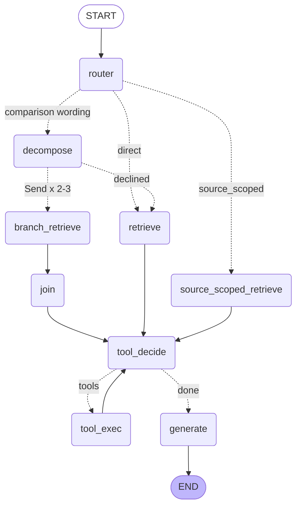

# G12 — Parallel fan-out (dispatch-and-aggregate): design (GATE 1)

Recorded 2026-10-08. This is the record of the read-only probes and the design, accepted at GATE 1 **before any
graph code**. The pre-registration is [`g12_PREDICTION.md`](g12_PREDICTION.md).

**Status:** see the Outcome section of [`g12_PREDICTION.md`](g12_PREDICTION.md). The fan-out ships switched off
(`FANOUT_ENABLED = False`).

**What G12 is.** Comparison questions dispatch one retrieval per sub-question, concurrently, through LangGraph's
`Send` API. A join node aggregates the results before `tool_decide` and generation, and one failing branch degrades
gracefully.

**What G12 is not.** It is a **dispatch-and-aggregate node**, not a hierarchy of autonomous agents. No branch plans,
calls tools or talks to another branch: each one runs a single retrieval and returns.

**Budget:** at most 2.5 build-days and $3.00 of API spend.

**Frozen:** `src/**`, `eval/dataset.jsonl`, the metric set, the namespace and k. Every existing `agent/` path stays
byte-identical for non-comparison questions.

**Row numbers are 1-based** (the G6 convention). The decomposition probe called the IDLH question "row 8", 0-based;
it is row 9 here. That probe numbered acetone "Row-25", 1-based, so it mixes the two conventions.

## GATE 1 decisions (accepted 2026-10-08)
- **Two-stage gate.** A deterministic wording pre-gate, then the decomposer confirms.
- **Join-level dedup through a `fanout` staging channel.** `retrieved` keeps its `operator.add` reducer, and
  `agent/state.py` gains one channel.
- **Rank-interleaved join.**
- **Per-branch depth = `settings.retrieval_k`.** The doubled context is the named cost.
- **`route = "decomposed"`,** with one docstring line in `api/schemas.py` and no API field.
- **P4 appends a failing branch** rather than replacing a real one.
- **The G6 KNOWN_LIMITATIONS line about the serializer warning gets corrected** (see R2).
- **Refinement A:** P3 is judged against a per-row band.
- **Refinement B:** the wording of P4 is made precise, and so is "the existing retrieval-error path".

## R1 — The decomposition prior, and today's single-query baseline
**The prior.** Sources: [`decomp_probe_PREDICTION.md`](../scripts/decomp_probe_PREDICTION.md) and
[`decomp_probe_RESULT.md`](decomp_probe_RESULT.md).
1. **Predicted:** decomposition would *partly* recover the IDLH comparison (row 9). The EPA sub-question would reach the
   top 10, and the NIOSH one would stay deep.
2. **Happened:** FALSIFIED, in the inverted direction. Neither sub-question reached the top 10. The NIOSH answer chunk
   was absent from the top 100; the EPA chunk improved from rank 27 to 13.
3. **Covered:** one row (row 9), on the old `semantic` namespace, with unscoped sub-questions.
4. **Root cause:** fat multi-record chunks. Structure-aware re-chunking (`semantic_v2`) fixed it; decomposition did
   not.
5. **Implication:** the repo has no evidence that decomposition improves *retrieval* on this corpus. Source-scoped
   sub-questions and `semantic_v2` were never tested. **G12 claims mechanism and resilience, not a metric gain.**

**Today's single-query baseline.** Taken from the newest local file with all 28 rows' contexts:
`g1_closure_q1_answers.json`, 2026-09-22, the CAP=0 arm, `fp_f240edfbb6`. Every value chunk below was read, not only
pattern-matched.

| row | compared sources | both source documents in the top 10? | each source's own value line in the top 10? | both values present anyway? |
|---|---|---|---|---|
| 9 | NIOSH Pocket Guide / EPA RMP ammonia refrigeration | **yes** (NIOSH ranks 2, 4, 5, 7, 8; EPA ranks 1, 3, 6, 10) | yes: NIOSH p45 "IDLH: 300 ppm" at rank 8; EPA p1 "toxic endpoint … 200 ppm" at rank 6 | yes |
| 10 | OSHA 1910.1000 / NIOSH Pocket Guide | **no**: OSHA absent | OSHA's chlorine line absent; NIOSH p89 at rank 1 | yes: the NIOSH entry also states "OSHA PEL† C 1 ppm" |
| 11 | OSHA 1910.1000 / NIOSH Pocket Guide | **no**: OSHA absent | OSHA's ammonia line absent; NIOSH p45 at rank 2 | yes: the NIOSH entry also states "OSHA PEL TWA 50 ppm" |
| 21 | Airgas chlorine SDS / OSHA 1910.1000 | **yes** (Airgas rank 1; OSHA ranks 2–5, 7–10) | Airgas "CEIL" at rank 1; **OSHA's chlorine line absent** (those OSHA chunks carry only the table's generic ceiling footnote) | yes: through the NIOSH p89 entry (rank 6) and the Airgas SDS |

**What this means:**
- **Sources:** one pass already retrieves both source documents on 2 of 4 rows, and both values on all 4.
- **Recall:** context recall is already **1.0 on all four rows** wherever it was scored (2026-08-02 to 2026-09-20), so
  there is no headroom.
- **Precision on the agent path:** row 9 ranges 0.65–0.96 across runs; row 10 is 0.82, row 11 0.56 and row 21 1.0.

## R2 — Sub-question generation, probed without the graph
**Setup.**
- The model is `gpt-4o-mini` at temperature 0, with structured output (`json_schema`), N=3 per row.
- The schema and prompt are registered in [`g12_PREDICTION.md`](g12_PREDICTION.md). The prompt was run exactly as
  frozen, with **no iterations**.
- The catalog is the same `doc_id: title` list the router uses.

**On the four comparison rows, all three trials were identical:**

| row | sub-questions, each with the `source_doc_id` it names |
|---|---|
| 9 | [niosh-pocket-guide] What is the NIOSH IDLH value for anhydrous ammonia? · [epa-rmp-ammonia-refrigeration] What is the EPA RMP toxic endpoint for anhydrous ammonia used in offsite consequence analysis? |
| 10 | [osha-1910-1000] What is the exposure limit for chlorine under OSHA? · [niosh-pocket-guide] What is the exposure limit for chlorine under NIOSH? |
| 11 | [osha-1910-1000] What is the occupational exposure limit for anhydrous ammonia under OSHA? · [niosh-pocket-guide] What is the occupational exposure limit for anhydrous ammonia under NIOSH? |
| 21 | [sds-airgas-chlorine] What is the chlorine exposure ceiling stated in the Airgas Safety Data Sheet? · [osha-1910-1000] What is the chlorine exposure ceiling stated in OSHA's Air Contaminants Table? |

**Results:**
- **Stability:** 12/12 decisions were `comparison=true`, each with 2 sub-questions. Every sub-question names exactly
  one known source, so each branch can use source-scoped retrieval.
- **As a gate on the other 24 rows:** `comparison=false`, with no sub-questions, in all 72 decisions. That includes
  row 8, the two-part cross-document question that does not compare. This is in-sample.
- **Run facts:**
  - fingerprints `fp_9f0c15766e` ×75 and `fp_ad19f60337` ×9;
  - p50 0.67 s, max 2.33 s;
  - $0.0122 for 84 calls.

**R2b — what each branch retrieves.** Each sub-question was searched source-scoped at k=10, and the join was
simulated read-only:
- **The value chunk was at rank 1 in 6 of 8 branches.** The exceptions are OSHA's chlorine line (Table Z-1, the chunk
  labelled p16), at rank 10 for row 10 and rank 9 for row 21. Row 9's EPA value was at rank 3.
- **Both sources were present on 4 of 4 rows,** against 2 of 4 for a single query, and OSHA's own value line was
  present on rows 10, 11 and 21.
- **Each joined context was 20 chunks, with 0 duplicates,** because the branches are scoped to different documents.
  That doubles the context sent to `tool_decide` and `generate`.

**A finding outside G12.** `json_schema` structured calls print a Pydantic serializer warning (`field_name='parsed'`)
**with tracing off, with or without `include_raw`**. This was checked on 2026-10-08. So the production router already
emits it, and the G6 line in [`KNOWN_LIMITATIONS.md`](KNOWN_LIMITATIONS.md) that ties it to tracing is wrong. G12's
docs step corrects it.

## The gate: two stages, on the router's direct route only
1. **A deterministic wording pre-gate.** The pattern is
   `\b(compare[sd]?|comparison|versus|vs\.?|agree|disagree|differ|differs|difference|higher than|lower than|stricter than)\b`,
   case-insensitive.
   - **Checked in-sample:** it hits exactly rows 9, 10, 11 and 21, and misses row 8.
   - It hits 0 rows of the capability set and 0 of the guardrail set.
2. **The decomposer confirms:** `comparison=true` with 2 or 3 sub-questions.

**Why two stages:**
- The 24 non-comparison rows never call the decomposer. They pay no latency and no cost, and their code path is
  unchanged, which is what P5 needs.
- P1's 0/72 is deterministic.
- A comparison the pattern misses takes today's single-query path, which does no harm.

**Rejected alternative:** the decomposer alone as the gate. It was stable in R2, but it would add about 0.67 s and
about $0.00015 to every direct-routed `/ask/agent` request.

## R3 — Dedup at the join, through a staging channel
- **Branches append one record each** to a new channel, `fanout: Annotated[list[dict], add]`. A record is
  `{branch, n, sub_question, source_doc_id, chunks, error, t_start, t_end}`.
- **The join** writes `retrieved` **exactly once**, adding onto the empty list from `fresh_state`. It sets
  `retrieval_error` only if every branch failed, and it writes the trace notes.
- **`retrieved` keeps its `operator.add` reducer.**
- **Why not dedup in the reducer:** that would change G1. Two identical tool calls produce identical synthetic chunks,
  and a deduping reducer would collapse them.
- **Why not §5's `Reset` sentinel** from [`replay_safety_design.md`](replay_safety_design.md):
  - the join needs each branch's outcome, its error and timing, for R4 and R5;
  - plain `add` gives the join no way to rewrite the list;
  - no existing path writes `fanout`, so their `retrieved` stays byte-identical by construction.
- **This deviates from §3 of the G12 spec,** which said `agent/state.py` would change only for reducer-level dedup. The
  file gains one channel (13 in all), `fresh_state` initializes it, and its channel table gets a row. The existing
  twelve-channel test becomes a thirteen-channel test.
- **Replay policy for `fanout`,** in the style of §4:
  - `add`, with one record per branch;
  - the join keys records by branch index (last one wins) and chunks by `chunk_content_key`, so an in-run retry is
    idempotent;
  - `fresh_state` per invocation blocks leaks between rows.
- **Join order:**
  - **Interleaving:** rank-interleaved, round-robin by rank across branches, in the decomposer's order, so each
    sub-question's best chunk comes first.
  - **Dedup:** by `chunk_content_key`, first occurrence wins. It does nothing when branches are scoped to different
    documents (R2b: 0 duplicates).
- **Per-branch depth** is `settings.retrieval_k`, with no new knob. A comparison therefore gets up to 20–30 chunks;
  that doubled context is the cost, named here.

## R4 — The degradation contract
- **Decomposition fails or declines → today's single-query `retrieve` on the original question,** with a trace note
  saying why. It never refuses because decomposition failed. The cases:
  - the decomposer raises;
  - it returns no parsed output;
  - it says `comparison=false`;
  - it gives fewer than 2 or more than 3 sub-questions.
- **An unknown `source_doc_id` from the decomposer** is mapped to unscoped (null) for that branch, with a note, the same
  way the router checks against `_known_doc_ids()`.
- **A branch** runs a scoped `dense_search` when it has a source id, otherwise an unscoped one.
  - **If it raises,** the result is a failure record: the branch index and exception class, and no chunks.
  - **If it returns 0 chunks,** that counts as a success with no evidence.
  - **If it is handed an id outside the manifest** (only possible by injection), it raises `ValueError` *before
    searching*.
- **The join, when at least one branch succeeded:** it rank-interleaves the survivors, dedups them, and notes each
  failed branch with its exception class. Generation runs on that partial context.
- **The join, when every branch failed:** it sets `retrieval_error=True` and `retrieved=[]`. That is **the existing
  retrieval-error path (empty answer, scored 0.0 "no answer generated")**: `tool_decide` and `generate` short-circuit
  and no generation call is made. It is not the refusal sentence.
- **Two failure points, tested in different places:**
  - **Validation time** (an id outside the manifest): the branch raises before any retrieval call. Live P4 exercises
    this, so it tests the join's tolerance of a failed branch record.
  - **Retrieval time** (`dense_search` raising inside a branch): tested hermetically only, by R6 test 4.

## R5 — Showing concurrency in the trace
**Trace format.** Each `Send` payload carries the dispatch time, `t0` from `time.monotonic()`. Each branch reports its
interval relative to it:

```text
decompose: comparison -> 2 sub-questions [niosh-pocket-guide, epa-rmp-ammonia-refrigeration] (0.66s)
fanout[1/2] retrieve(source_scoped:niosh-pocket-guide) t+0.003s..t+0.512s -> 10 chunks
fanout[2/2] retrieve(source_scoped:epa-rmp-ammonia-refrigeration) t+0.004s..t+0.497s -> 10 chunks
join: 2/2 branches ok -> 20 chunks, 20 after dedup (0 duplicates)
```

A failed branch reads `fanout[3/3] retrieve(source_scoped:no-such-doc) t+0.003s..t+0.003s -> ERROR ValueError`, and the
join names it.

**Hermetic test:** `test_fanout_branches_run_concurrently`. A fake `dense_search` sleeps 200 ms, and 3 branches must
finish in **under 450 ms** of wall time with overlapping trace intervals.

**Feasibility evidence:**
- **Concurrency:** a toy LangGraph 1.0.1 graph ran 3 × 200 ms `Send` branches in 0.204 s of wall time, with
  overlapping intervals.
- **Order:** the `add` reducer kept `Send` order (1, 2, 3).

## R6 — The hermetic test plan (`tests/test_fanout.py`; LLMs stubbed, no network)
1. **The gate.**
   - Rows 9, 10, 11 and 21 fan out; the trace shows `decompose` and `fanout[i/n]`.
   - Rows 1, 4, 16 and 25 take the unchanged path, and the decomposer stub is asserted not called. Row 25 runs through
     a source-scoped router stub.
2. **Branch count.** The number of `Send`s equals the number of sub-questions (tested with 2 and 3). Four sub-questions
   fall back to a single query.
3. **The join.** It rank-interleaves, then dedups by content key; tested with overlapping stub chunks.
4. **One branch raises during retrieval.** Generation runs on exactly the survivors' contexts, and the trace names the
   failed branch and its exception class.
5. **Every branch raises.** `retrieval_error` is set, `generate` is not called, and the answer is `""`.
6. **The decomposer raises, returns nothing, declines, or exceeds the cap.** The question falls back to a single query,
   with a trace note.
7. **Concurrency:** `test_fanout_branches_run_concurrently`.
8. **Byte-identity on every non-fan-out path.** That covers direct, source-scoped, the source-scoped fallback and the
   tool loop. A recording fake asserts the exact `dense_search` calls and the exact `generate` inputs.
9. **Invariant (a):** consecutive asks leak no `retrieved`, `fanout` or `trace_notes`. This includes the
   thirteen-channel test.
10. **`tool_decide` still runs after the join,** and a tool chunk is appended after the joined chunks.
11. **Validation.** An unknown `source_doc_id` from the decomposer becomes unscoped; an injected unknown id makes its
    branch raise.
12. **The decomposer prompt and schema** in `agent/graph.py` are byte-identical to the ones registered in
    [`g12_PREDICTION.md`](g12_PREDICTION.md).

## Route and API
- **Route:** the decompose node sets `route = "decomposed"`; [`agent/state.py`](../agent/state.py) already documents
  that value.
- **Routing reason:** `_routing_reason` in [`agent/graph.py`](../agent/graph.py) renders "Comparison split into N
  sub-questions: …".
- **API:** no new field and no code change. One docstring line in `api/schemas.py` adds `"decomposed"` to the route
  values.

## Out of scope, and follow-ons
**Out of scope:**
- any change under `src/`;
- editing the decomposer prompt after the first scored run;
- a supervisor or hierarchy framing;
- more than 3 branches;
- multi-turn state;
- changing k or the namespace;
- a second mechanism if P3 is falsified (a falsified gain with a working, resilient mechanism is a valid closure).

**Follow-ons:**
- a per-branch depth knob, to bound the doubled context;
- a decomposer-only gate, if the wording pre-gate's recall on unseen comparison phrasings matters.

## Fan-out topology (the enabled build)
The shipped graph is built with `FANOUT_ENABLED = False` and has the pre-G12 topology; that is the block in
`README.md`. The block below is `scripts/render_graph.py`'s output for `_build_graph(fanout=True)`:
- the edge labels are hand-curated, as in the README;
- the node and edge sets are the measured build's, at the commit the live run executed. This is asserted by
  `test_enabled_graph_topology_matches_the_measured_build`.


