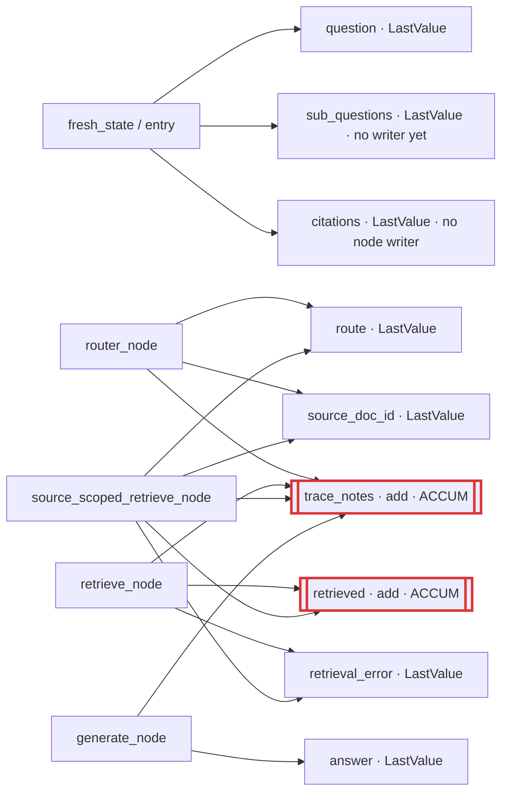
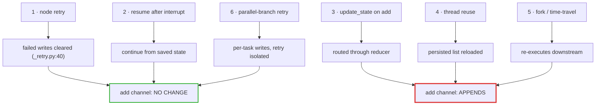
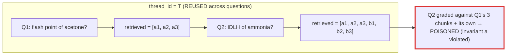
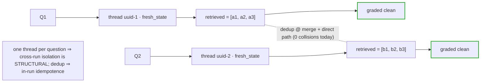

# LangGraph replay safety for `AgentState` — DESIGN (read-only; source- + probe-verified, no code changes)

`agent/state.py` gives `retrieved` and `trace_notes` an `add` reducer (`state.py:102,105`) so parallel
sub-question branches concatenate instead of overwriting, and the eval harness can assert the path taken. The
graph is **safe today**: it is compiled bare (`builder.compile()`, `graph.py:239`) and invoked
`.invoke(fresh_state(question))` with no `config`/`thread_id` (`graph.py:265`) — no checkpointer, no interrupts,
no `RetryPolicy`, no `update_state` anywhere (whole-repo grep: zero hits). Isolation rests entirely on
`fresh_state()` (`state.py:132`) minting a new dict per call, which is sufficient *because nothing persists*.

The hazards below activate the moment G10b adds a checkpointer (the human approval gate needs `interrupt_before`
+ resume, which need persistence). This is a **pre-implementation design pass**: no code changes here. Every
LangGraph 1.0.1 claim carries a **source `file:line`** (langgraph 1.0.1 / langgraph-checkpoint 3.0.1, the
`pyproject.toml` pins) **and a probe verdict** from a throwaway `scripts/replay_safety_probe.py` (self-contained,
in-memory, deleted after; raw output in the appendix). It **supersedes** the docstring's retry-only framing —
see §1.

## 1. What this supersedes in `state.py` (three corrections)

The `state.py` docstring is load-bearing and mostly right, but now wrong on three points. This doc is the
authority on them; the docstring should be updated when the reducer is next touched.

1. **The retry framing is mis-aimed.** `state.py:55-60` warns "a retried `retrieve_node` under `add` would
   DOUBLE `retrieved`." **False in LangGraph 1.0.1.** Each retry attempt runs `task.writes.clear()` *before*
   re-executing (`pregel/_retry.py:40`), so a failed attempt's writes are discarded and only the successful
   attempt's writes apply — once. **Probe EXP1:** the node body ran twice, committed `retrieved == ['A']` (one
   copy). Node retry is the **safe** re-entry path. The docstring warns about the one that doesn't bite.
2. **The real doublers are elsewhere:** `update_state` (appends through the reducer — EXP3), **thread reuse**
   (accumulates across invokes — EXP4), and **fork/replay** (re-executes downstream — EXP5). These are exactly
   the mechanisms the approval gate introduces. The docstring names none of them.
3. **Two stale facts.** "EIGHT channels" (`state.py:14,135`) is wrong — there are **9**; `source_doc_id`
   (`state.py:100`) was added for the 2C router and never folded into the prose/table. And `chunk_content_key`
   (`state.py:154`) is **defined but never called** (no call site in `agent/`, `src/`, `api/`, `eval/`), so dedup
   runs on **no path today**, not "join-only." The CAUTION's "dedup does not run on the direct path" is true but
   understates it.

## 2. Re-entry paths — the empirical table (Deliverable 1)

Every row is **source-cited and probe-verified**. "Re-executes a node?" is about node *bodies*; "effect on an
`add` channel" is what lands in `retrieved`/`trace_notes`.

| # | Re-entry path | Re-executes a node? | Effect on an `add` channel | Source (langgraph 1.0.1) | Probe |
|---|---|---|---|---|---|
| 1 | **Node retry** (`RetryPolicy`, fail-once) | YES (body re-runs) | **No change** — failed-attempt writes cleared, success applied once | `pregel/_retry.py:40` (`task.writes.clear()`) | EXP1: body ran 2×, `acc=['A']` |
| 2 | **Resume after `interrupt_before`** | NO (completed nodes) | **No change** — continues from saved channel state | `pregel/_loop.py:503,663-672` | EXP2: `acc=['N1','N2']`, n1 not re-run |
| 3 | **`update_state` on an `add` channel** | NO (applies your values as writes) | **APPENDS** — routed through the reducer | `pregel/main.py:1818,1852` → `channels/binop.py:86-94` | EXP3: `['base']`→`['base','HUMAN_EDIT']` |
| 4 | **Thread reuse** (2nd `.invoke()`, same `thread_id`) | YES (full graph on new input) | **APPENDS onto the persisted list** — cross-question poisoning | `checkpoint/memory/__init__.py:178-180` (latest per `thread_id`) | EXP4: `['q:Q1']`→`['q:Q1','q:Q2']` |
| 5 | **Fork / time-travel** (resume from earlier `checkpoint_id`) | YES (downstream of the fork) | **Re-appends** in the fork branch | `checkpoint/memory/__init__.py:148-149,357` | EXP5: fork@`['A']` → `['A','B']` |
| 6 | **Parallel-branch retry** (one fan-out branch fails+retries) | YES (that branch only) | Retried branch applied **once**; siblings unaffected | `pregel/_retry.py:40` + per-task write harvest | EXP6: X ran 2×, `acc=['w:X','w:Y']` |

**Reading of the table:** the only path that *discards* re-execution writes is intra-super-step node retry
(1, 6). The **checkpoint-replay family (3, 4, 5) all append** — and all three are introduced by the approval
gate. Resume (2) is safe because it never re-runs completed nodes. So the design effort belongs on `update_state`
(§5) and thread lifecycle (§3), not on retry.

## 3. Thread lifecycle (Deliverable 2)

**The tension.** Invariant (a) (`state.py:66-73`) demands a fresh `AgentState` per question. Checkpointing
persists state per `thread_id`, and EXP4 shows a reused thread accumulates across questions. The resolution
sets the API shape. **The no-checkpointer status quo is not a lifecycle option** — it precludes the
interrupt/resume the gate needs, i.e. it is a decision *not* to build the feature.

**Recommendation: ONE THREAD PER QUESTION** — a fresh `uuid4` `thread_id` per `ask()`. Every eval row and every
`/ask` request is independent; multi-turn is not a current requirement and would need a separate mechanism.

| Option | Multi-turn? | How invariant (a) holds | Consequence for `eval/run_eval.py` (28 rows, one process) |
|---|---|---|---|
| **One thread per question (RECOMMENDED)** | No (needs a separate mechanism) | Fresh `thread_id` + `fresh_state` per call → nothing to leak | **Structurally safe.** Each `ask()` gets a new thread, so EXP4 poisoning **cannot** occur — same isolation as today's bare invoke, now with a checkpointer for the gate |
| One thread per conversation + per-turn reset | Yes | Only if per-turn channels are reset at entry, enforced structurally (a first node that clears them) | **Dangerous.** If 28 rows shared a thread and reset were by convention, one missed reset re-introduces EXP4 poisoning across all rows. Acceptable only if the reset is a graph node, not a habit |
| Split schema (per-turn vs conversation-scoped channels) | Yes | Per-turn channels (`retrieved`, `trace_notes`) reset each turn by construction; a `messages`/history channel accumulates | Safe (per-turn channels reset per row regardless of thread), but more machinery — worth it only when multi-turn actually lands |

**Cross-row poisoning must be STRUCTURAL, not conventional** (the invariant-(a) mandate). With one-thread-per-
question it is: `ask()` generates a fresh `thread_id` per call and NEVER a fixed/default one (a default
`thread_id` would be EXP4 across all 28 rows in a single process — the exact hazard invariant (a) exists for).

Two questions one-thread-per-question forces, both G10b infra decisions named here because they change the design:

- **TTL / resolution.** An interrupted thread must **outlive the request** (a reviewer returns an hour later),
  so unresumed threads accumulate. Policy: a paused thread carries a TTL (e.g. 24 h); on expiry it resolves as
  **REJECTED** and its state is discarded — an un-acted safety review must never silently become an answer.
- **Durability (the sharp one).** Render's free tier has **no persistent disk**, so a `SqliteSaver` (or
  in-memory saver) **resets on every redeploy**, silently losing every paused approval — the reviewer returns to
  a thread that no longer exists. Two acceptable answers, one forbidden:
  - **Postgres checkpointer** — survives redeploy; the real fix if the gate must be reliable.
  - **Accept the loss and FAIL CLOSED** — on a missing/expired thread the resume endpoint returns "review
    expired, resubmit"; it MUST NOT fall through to answering the unreviewed question.
  - **FORBIDDEN:** any path where a lost thread degrades to serving an un-reviewed answer on a safety corpus.

## 4. Per-channel replay policy (Deliverable 3)

One rule per channel, chosen from {idempotent-return, replay-aware-dedup, write-once-guard, staging-channel} —
not one policy applied globally.

| # | Channel | Reducer | Writer node(s) | Chosen policy under replay + why |
|---|---|---|---|---|
| 1 | `question` | LastValue | entry (`fresh_state`) | **Idempotent** — set once, re-execution rewrites the same value |
| 2 | `sub_questions` | LastValue | none yet (future `decompose`) | **Idempotent-return** — decompose returns the whole list; replace is replay-safe |
| 3 | `route` | LastValue | `router`, `source_scoped` (fallback) | **Idempotent** — two *sequential* writers, deterministic last-wins |
| 4 | `source_doc_id` | LastValue | `router`, `source_scoped` (fallback) | **Idempotent** — same |
| 5 | `retrieval_error` | LastValue | `retrieve`, `source_scoped` | **Idempotent** — single logical writer per path |
| 6 | **`retrieved`** | **add** | `retrieve`, `source_scoped` (+ future fan-out) | **Replay-aware dedup** — see below |
| 7 | `answer` | LastValue | `generate` | **Idempotent** — replace |
| 8 | `citations` | LastValue | none yet (API owns; 2B may move in) | **Idempotent**; when assembled in-graph, reuse `api/citations.py`'s `(document,page)` dedup per invariant (b) — do NOT merge with `chunk_content_key` |
| 9 | **`trace_notes`** | **add** | ALL nodes | **Keep append; duplicates DESIRABLE** — see below |

**`retrieved` — replay-aware dedup, and why not the alternatives.** Keep `add` (fan-out must concatenate) and
apply `chunk_content_key` (`state.py:154`) dedup at the 2B merge/`synthesize` step, where fan-out overlap is
folded. **Also apply it on the direct path:** Step 1b swept all 28 dataset rows at k=10 on `semantic_v2` and
found **0 exact-`(source_doc_id, page, text)` collisions**, so direct-path dedup is a **no-op today** and
therefore v4-byte-repro-safe — applying it there closes the CAUTION's gap and makes `retrieved` idempotent under
any in-run replay at zero cost. **CAVEAT:** re-verify collisions if the retrieval mode or namespace changes; a
future mode that returns exact-duplicate triples would make direct-path dedup alter v4 output, at which point it
moves back to merge-only. *Not write-once-guard* (fan-out legitimately writes `retrieved` from N branches);
*not a staging channel* (unnecessary once dedup folds the list). Dedup handles **in-run** idempotence (retry,
fork re-execution of the same query → identical triples collapse); **cross-run** isolation (thread reuse of two
*different* questions → different chunks dedup can't remove) is handled by one-thread-per-question (§3). Two
layers, two hazards.

**`trace_notes` — keep append, do not dedup.** This is the one channel where accumulation on replay is a
**feature**: a re-executed node genuinely ran twice, and the path record *should* say so (that is its
eval-assertion value — `state.py:42-46`). Deduping breadcrumbs would hide real re-execution. Leave `add`,
never apply `chunk_content_key`.

## 5. The `update_state` contract for the approval gate (Deliverable 4)

Argued from **what a reviewer at a safety-document gate actually does**, not implementation ease: **approve** and
**reject** are the common paths; the useful third is **narrow — drop one obviously-wrong chunk and proceed**.
Wholesale replacement means hand-authoring the context set, which nobody does. So **`remove` is first-class** and
`replace` falls out of the same mechanism.

EXP3 established that `update_state` routes values through the channel reducer. Against `retrieved`'s `add`:

| Operation | Expressible on plain `add`? | Mechanism |
|---|---|---|
| **append** context | Yes (native) | `update_state(cfg, {"retrieved": [chunk]})` appends (EXP3) |
| **remove** a specific chunk | **No** — `add` is monotonic | A custom reducer that recognizes a **`RemoveChunk(key)` sentinel** and drops the chunk whose `chunk_content_key` matches, instead of appending |
| **replace** the whole set | **No** | = clear-then-append via the **same sentinel family**: a `Reset()` token empties the list, then the new chunks append. Rare; it is `remove-all + append` |

**Design:** replace `retrieved`'s reducer (`operator.add`) with a small custom reducer that (a) appends plain
chunk lists (fan-out concatenation preserved), (b) drops chunks on a `RemoveChunk(key)` sentinel, (c) clears on
`Reset()`. **This is a future code change, out of scope here** — today `add` is correct because no human
amendment exists.

**Resume endpoint contract:** a typed amendment —
`{op: "approve" | "reject" | "amend", removals: [chunk_key, …], additions: [chunk, …]}`.
`approve` → resume unchanged; `reject` → resolve the thread as rejected (no answer emitted); `amend` →
`update_state` with the removal sentinels + additions, then resume. `replace` is `amend` with
`removals = all, additions = new` (rare). **Correctness-critical:** on a safety corpus the reducer must apply a
removal *exactly* — drop the one wrong chunk, keep the rest — which plain `add` cannot; making `remove`
first-class forecloses that latent human-review bug.

## 6. Diagrams (Deliverable 5)

### 6.1 Channel map — 9 channels, reducer per channel, writers; accumulators marked


### 6.2 Re-entry paths → where each lands


### 6.3 The hazard — `retrieved` doubling under thread reuse (concrete)


### 6.4 The chosen design — why it can't happen


## 7. Probe findings (appendix — raw)

`scripts/replay_safety_probe.py` (self-contained langgraph 1.0.1 + `InMemorySaver`; in-memory only, no LLM/
network/eval; deleted after this pass). Verbatim verdicts:

```
EXP 1 node retry:        body executed 2 times; committed acc=['A']         -> DOES NOT double
EXP 2 interrupt+resume:  acc=['N1','N2']; n1 not re-executed                -> continues from saved state
EXP 3 update_state:      add acc ['base']->['base','HUMAN_EDIT'] (APPENDS); LastValue last->'HUMAN_EDIT' (REPLACES)
EXP 4 thread reuse:      acc ['q:Q1'] -> ['q:Q1','q:Q2']                    -> ACCUMULATES (cross-question poisoning)
EXP 5 fork/time-travel:  fork@['A'] -> resume forward -> ['A','B']          -> re-executes downstream, re-appends
EXP 6 parallel retry:    workerX ran 2x, acc=['w:X','w:Y']                  -> retried branch once, sibling unaffected
```

Step 1b (direct-path dedup safety, read-only retrieval sweep):
```
namespace='semantic_v2' k=10 : 0 exact-(source_doc_id,page,text) collisions across 28 rows
=> direct-path chunk_content_key dedup is a NO-OP today (re-check if retrieval mode/namespace changes)
```

Every §2 claim is thus backed by both a langgraph-1.0.1 source line and an in-memory probe verdict — no
version-specific behavior is asserted from memory.
